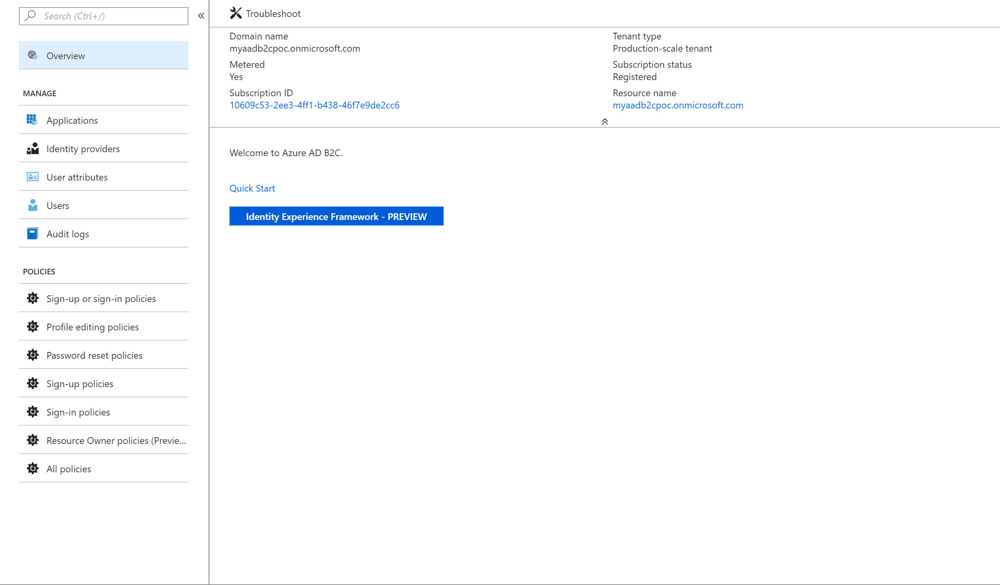
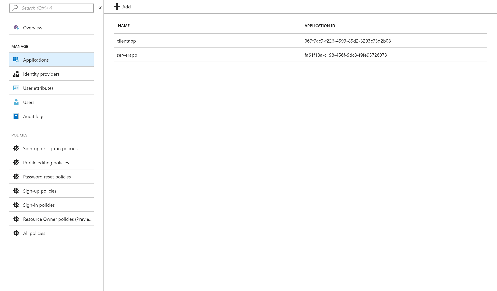
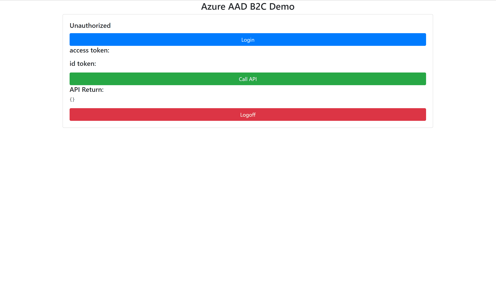
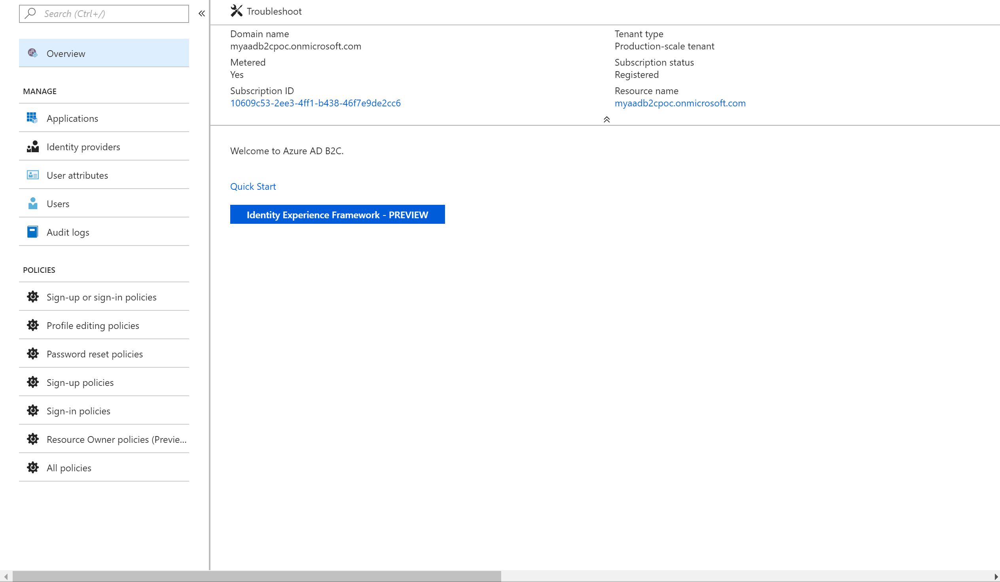

# Azure Active Directory B2C with WeChat as Identify Provider 

This is a repository contains code and document about how to integrate Azure Active Directory (AD) B2C with WeChat as Identify Provider plus enabling MFA to validate user phone number and using RESTAPI to validate user input when signup. 

Here are the key features of this project and custom policy are used to implement these function.

* WeChat as IDP
* MFA to validate user mobile phone
* Invitation Code Check
* WeChat union id stored into Active Directory

There several applications in this repository.
1. server app, which has an API protected by Azure AD B2C. User can invoke it after signin the AD.
2. web client app, which is a html app, and it will rediect user to AD B2C login page and get access token and id token from AD B2C.
3. An API app, which is mockup app to validate invitation code input by user.

## Integerate Azure AD B2C with WeChat with Build-in Policy.

### Here is a document to setup Azure AD B2C.

https://azure.microsoft.com/en-us/trial/get-started-active-directory-b2c/


### Setup application in Local
```shell
npm install
```

```shell
node ./server.js
```

>Open the url 
[http://localhost:5000/client](http://localhost:5000/client) . If clicking the Call API button, it will show error message as no permission to call it.

### Create serverapp and clientapp in Azure AD B2C.

Here is a document to teach how to create app in AZure AD B2C
https://docs.microsoft.com/en-us/azure/active-directory-b2c/active-directory-b2c-tutorials-spa


### Here is some screenshots of AD B2C Tenant, to check the server app and client app setting.

1. Azure AD B2C Tenant settings


2. Azure AD B2C serverapp settings


3. Azure AD B2C clientapp settings


Edit public/config.js and change into the key and url.
```javascript
var config = {
    tenantID : "myaadb2cpoc.onmicrosoft.com",
    clientID : "fa61f18a-c198-456f-9dc8-f9fe95726073",
    policyName : "B2C_1_myaadb2cpoc",
    loginURL : "https://login.microsoftonline.com/myaadb2cpoc.onmicrosoft.com/oauth2/v2.0/authorize?p=B2C_1_myaadb2cpoc&client_id=067f7ac9-f226-4593-85d2-3293c73d2b08&nonce=defaultNonce&redirect_uri=http%3A%2F%2Flocalhost%3A5000%2Fclient%2F&scope=openid%20https%3A%2F%2Fmyaadb2cpoc.onmicrosoft.com%2Fserver%2Fread%20https%3A%2F%2Fmyaadb2cpoc.onmicrosoft.com%2Fserver%2Fuser_impersonation%20https%3A%2F%2Fmyaadb2cpoc.onmicrosoft.com%2Fserver%2Fwrite&response_type=id_token%20token&prompt=login",
}
```
>The clientID is serverapp Application ID

>Here is a screenshots of how to get loginURL


### Restart local node app
```shell
node ./server.js
```
Here is a screenshot for this build-in policy demo


## Get WeChat User Information after signin.

### Here is a document introduce what is Azure AD B2C and how to create custom policy. in this document, there is a starter kit for custom policy composing. 

https://docs.microsoft.com/en-us/azure/active-directory-b2c/active-directory-b2c-get-started-custom

To integrate WeChat 4 custom policy files need to be uploaded.

1. [TrustFrameworkBase.xml](/custompolicy/custom-policy-wechat-1-wechat-userinfo/TrustFrameworkBase.xml)
2. [TrustFrameworkExtensions.xml](/custompolicy/custom-policy-wechat-1-wechat-userinfo/TrustFrameworkExtensions.xml)
3. [SignUpOrSignin.xml](/custompolicy/custom-policy-wechat-1-wechat-userinfo/SignUpOrSignin.xml)
4. [TrustFrameworkExtensions.xml](/custompolicy/custom-policy-wechat-1-wechat-userinfo/ProfileEdit.xml)

The four files are from the starter kit of SocialAccounts, which is for FaceBook.
[/custompolicy/SocialAccounts/](/custompolicy/SocialAccounts/)

### Here is a screenshot to show how to upload the custom files and get the new loginURL from custom policy.



### Here is a screenshot to get LoginURL from custom policy.


### Edit public/config.js and change into the policyName and loginURL.
```javascript
var config = {
    tenantID : "myaadb2cpoc.onmicrosoft.com",
    clientID : "fa61f18a-c198-456f-9dc8-f9fe95726073",
    policyName : "B2C_1A_signup_signin",
    loginURL: "https://login.microsoftonline.com/myaadb2cpoc.onmicrosoft.com/oauth2/v2.0/authorize?p=B2C_1A_signup_signin&client_id=067f7ac9-f226-4593-85d2-3293c73d2b08&nonce=defaultNonce&redirect_uri=http%3A%2F%2Flocalhost%3A5000%2Fclient%2F&scope=openid%20https%3A%2F%2Fmyaadb2cpoc.onmicrosoft.com%2Fserver%2Fread%20https%3A%2F%2Fmyaadb2cpoc.onmicrosoft.com%2Fserver%2Fuser_impersonation%20https%3A%2F%2Fmyaadb2cpoc.onmicrosoft.com%2Fserver%2Fwrite&response_type=id_token%20token&prompt=login",
}
```

### Here is a screenshot to show a demo of loading user info of WeChat.


To be continued.